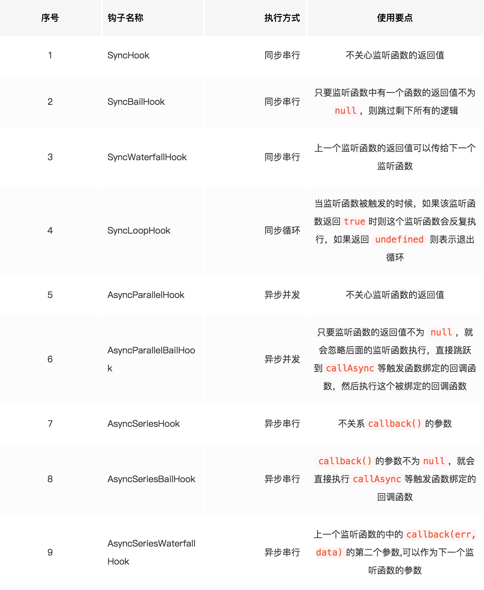

## directory

```javascript
	- src
		- sim  	 ---- 简单的模拟实现
		- /.js$/ ---- 使用
``` 

## Detailed 

Webpack 就像一条生产线, 要经过一系列的处理流程才能将源文件转换成输出结果。这条生产线上的每个流程都是单一的, 多个流程之间存在依赖关系。只能完成当前处理后才会转交到下一个流程。  

插件就像一个插入到生产线中的一个功能, 它会在特定的时机对生产线上的资源进行处理。 

这条生产线很复杂, Webpack则是通过 `tapable` 核心库来组织这条生产线。 

Webpack 在运行中会通过 `tapable` 提供的钩子进行广播事件, 插件只需要监听它关心的事件,就可以加入到这条生产线中,去改变生产线的运作。使得 Webpack整体扩展性很好。  


## Tapable Hook 

Tapable 提供同步(Sync)和异步(Async)钩子类。而异步又分为 `异步串行`、`异步并行`钩子类。 



逐个分析每个钩子类的使用及其原理 

## 同步钩子类 
 - SyncHook
 - SyncBailHook
 - SyncWaterfallHook
 - SyncLoopHook 

同步钩子类通过实例的 `tap` 方法监听函数, 通过 `call`发布事件  

### SyncHook 
同步串行不关心订阅函数执行后的返回值是什么。其原理是将监听(订阅)的函数存放到一个数组中, 发布时遍历数组中的监听函数并且将发布时的 `arguments`传递给监听函数 

```javascript
class SyncHook {
	constructor(options) {
		this.options = options
		this.hooks = []  //存放监听函数的数组
	}
	tap(name, callback) {
		this.hooks.push(callback)
	}
	call(...args) {
		for (let i = 0; i < this.hooks.length; i++) {
			this.hooks[i](...args)
		}
	}
}

const synchook = new SyncHook('name')
// 注册监听函数
synchook.tap('name', (data) => {
	console.log('name', data)
})
synchook.tap('age', (data) => {
	console.log('age', data)
})

// 发布事件
synchook.call('qiqingfu')
``` 
打印结果: 
```
name qiqingfu
age qiqingfu
``` 

### SyncBailHook 
同步串行, 但是如果监听函数的返回值不为 `null`, 就终止后续的监听函数执行 

```javascript
class SyncBailHook {
		constructor(options) {
			this.options = options
		  this.hooks = []
	}
	tap(name, callback) {
		this.hooks.push(callback)
	}
	call(...args) {
		let ret, i = 0
		do {
			// 将第一个函数的返回结果赋值给ret, 在while中如果结果为 true就继续执行do代码块
			ret = this.hooks[i++](...args)
		} while(!ret)
	}
}

const syncbailhook = new SyncBailHook('name')

syncbailhook.tap('name', (data) => {
	console.log('name', data)
	return '我的返回值不为null'
})
syncbailhook.tap('age', (data) => {
	console.log('age', data)
})

syncbailhook.call('qiqingfu')
``` 
执行结果
```
name qiqingfu
``` 

### SyncWaterfallHook 
同步串行瀑布流, 瀑布流指的是第一个监听函数的返回值,做为第二个监听函数的参数。第二个函数的返回值作为第三个监听函数的参数,依次类推... 

```javascript

```


